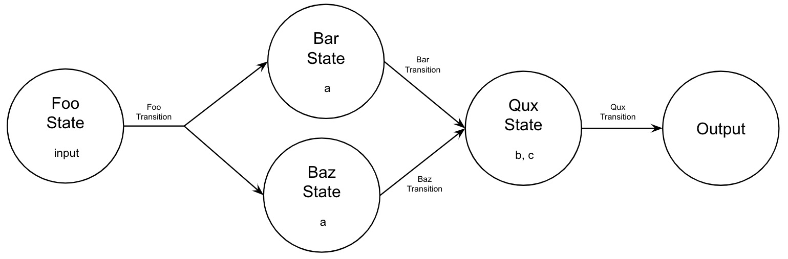

[](http://travis-ci.org/philipce/gruffle.svg)
[](https://codeclimate.com/github/philipce/gruffle.svg)
[](https://badge.fury.io/rb/gruffle)


Gruffle is a framework that helps developers decompose large jobs into small units of work. The goal is to encourage patterns and provide tools that help improve traceability, reliability, and scalability.

## Table of Contents

- [Overview](#overview)
    - [States](#states)
    - [Transitions](#transitions)
    - [Workflows](#workflows)
    - [Engine](#engine)
    - [Adapters](#adapters)
- [Example Application](#example-application)    
- [Scaling Workflows](#scaling-workflows)
- [Contributing](#contributing)

## Overview

The most straightforward way to code up some arbitrary job is as a monolithic function. This isn't necessarily a bad approach--it's easy to do, may be performant, and can be quite readable when well-factored. For example, consider the job defined below:

```ruby
def job(input)
  a = foo(input)
  b = bar(a)
  c = baz(a)
  return qux(b, c)
end
```

Any monolithic function could be written similarly. We've just extracted methods to get a high-level view of our job and easily see what work units are performed, the order they are performed in, and what data each depends on.

As an alternative to the monolithic function, Gruffle proposes the concept of workflows. Whereas our monolithic job implicitly describes work units by its code organization, workflows make that organization explicit. Instead of thinking of a job as one piece of code with many conceptual parts, a workflow models a job as a collection of self-contained, individually executable units of work with a well-defined control/data flow between them. This concept can be illustrated as a graph, shown below:

  

This graph-based view of a workflow introduces _states_ (nodes in the graph), and _transitions_ (edges between nodes). A state is an immutable collection of data. It encapsulates all the necessary parameters to perform some work unit; essentially, it's a parameter object to some function. Those functions are called transitions. Transitions consume a single state and result in some number of successor states. This is where the actual work gets done; whatever processing is required to advance through a workflow is encapsulated in its constituent transition functions.

At first, this might just seem like a more complex way to say the same thing as our monolithic function. So, what value does this paradigm add? We mentioned the value proposition earlier: improved traceability, reliability, and scalability. We're now in a spot to discuss why.
- **Traceability**: Each work unit is represented by the transition of one state to the next. Because this is explicitly defined, Gruffle can automatically trace details of execution for you: when a state was created, how long each transition took, what successor states resulted, etc. Most of the logging that a developer would need to manually insert into a monolithic function can be achieved automatically. Logging granularity is easily controlled by creating finer- or coarser-grained states in your workflow.
- **Reliability**: Real-world jobs can fail for many reasons outside the developer's control: network request timeouts, database deadlocks, non-deterministic algorithms, etc. In many cases, simply retrying later can resolve the issue. Workflows can automatically retry just the state transition that failed, eliminating the need to re-run the entire job. This reduces wasteful computation and can improve the chances of the workflow successfully completing. In cases where a simply retrying is insufficient, workflows make it easy to define your own error states and reason about what custom handling is required.
- **Scalability**: It's often the case that parts of a job are independent of others. By making dependencies explicit, workflows can automatically process state transitions in parallel where possible (like `Bar` and `Baz` in our example). Moreover, since states are immutable and encapsulate the data required for processing, workflows can be executed on any number of machines, making it easy to scale out as the need arises.

Hopefully this overview gives a good sense of what Gruffle is and how it may be useful. If you'd rather see it in action than continue slogging through docs, checkout the [example application](#example-application) for a simple, but fully functional workflow you can easily run on your own machine. Otherwise, read on; the next sections go into detail on how to define and use workflows. 

### States

TODO: Add detail on
- inheriting from base class
- considerations for testing
- what a state captures for you
- instance methods for defining/parsing your own payload
- other instance methods you may want to define: validation, retry logic, behaviors, etc

### Transitions

TODO: Add detail on
- inheriting from base class
- considerations for testing
- creating a transition result
- raising retry/fatal errors
- conditional execution

### Workflows

TODO: Add detail on
- inheriting from base class
- considerations for testing
- built in workflow validation
- simple state declarations, e.g. types of states
- simple transition declarations
- advanced state/transition declaration options
- versioning, priority, etc

### Engine

TODO: Add detail on
- considerations for testing
- instance vs class execution
- blocking vs non-blocking execution
- patterns for running engines
- execution hooks

### Adapters

TODO: add detail on
- what adapters can be plugged in
- how adapters are used
- default adapters
- limitations of default adapters
- link to scaling section and description of how/why

## Example Application

TODO: add detail on
- link to github repo

## Scaling Workflows

TODO: add detail on
- recap adapter limitations
- describe adapter approach (how/why gruffle uses them)
- link to relevant adapter repos (e.g. sqs, postgres, redis, etc)

## Contributing

All contributions are welcome! Feel free to make a pull request or open an issue.