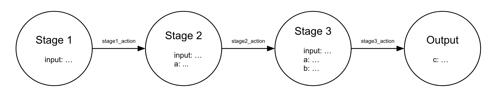

[](http://travis-ci.org/philipce/gruffle.svg)
[](https://codeclimate.com/github/philipce/gruffle.svg)
[](https://badge.fury.io/rb/gruffle)


Gruffle is a framework for processing jobs. It can run background jobs, or it can run a job synchronously. It can run in parallel, or it can process sequentially. It can distribute work at a large scale, or it can run on a local machine. It's unopinionated about the types of jobs it processes, so it's made to be adaptable by the user while still being useful out of the box. Flexibility and simplicity go hand-in-hand, so core functionality is limited to just the essentials. Extension is left to the user, and the framework aims to make that easy.

The purpose of Gruffle is to help users write arbitrary jobs that are: traceable, scalable, and reliable.

## Table of Contents

- [Overview](#overview)
- [Features](#features)
	- [Nodes](#nodes)
	- [Edges](#edges)
	- [Workflows](#workflows)
	- [Adapters](#adapters)
	- [Engine](#engine)
- [Scaling](#scaling)
- [Example Application](#example-application)
- [Contributing](#contributing)

## Overview

This framework provides utility for structuring your code as a series of small, connected stages of work that together constitute a larger job. This structure has some nice implications for parallelism and distributed processing, but there's a lot of value to be had even if execution is sequential and local. To illustrate, consider the following generic job:

```ruby
def run(input)
  a = stage1(input)
  b = stage2(input, a)
  c = stage3(input, a, b)
  return c
end
```

This can be modeled as a directed graph, where a node represents a stage and an edge represents running that stage. Visually, the same generic job could look like this:

  

This view of the job isn't too different, but does suggest an alternative way of framing the problem: 
- a _node_ is an immutable piece of data, with associated actions that consume that data in order to perform some work
- an _edge_ is the execution of an action on a _source node_ that generates a successor, or _target node_
- a job is a set of nodes, connected by edges, which we'll call a _workflow_

A workflow can be executed, or run, by starting with an initial _root node_, executing the relevant action on the node, and repeating the process on any successors until a _final node_ is reached (i.e. a node with no edges leading out of it). 

We can define two structures to help us process a workflow: a global node store and worker queue. As the name suggests, the node store is just a key-value store that keeps track of every node instance, associating each (serialized) node instance with its unique id. The worker queue holds ids of nodes that still need processing (i.e. nodes that haven't yet been processed during the current run). More concretely then, execution of our workflow would look like this:

The workflow begins with creating a root node and adding the node's id to the worker queue:

| Node Store                                                          | Worker Queue      |
| ------------------------------------------------------------------- |-------------------|
| 4653: {name: "stage1", ..., payload: {input: ...}}                  | {node_id: 4653}   |

The next available worker picks up the next piece of work from the queue and uses it lookup the node to process. It performs the relevant action for that node, stores the successor, and enqueues new work. After one step of our workflow, our node store and worker queue look like this:

| Node Store                                                          | Worker Queue      |
| ------------------------------------------------------------------- |-------------------|
| 4653: {name: "stage1", ..., payload: {input: ...}}                  | {node_id: 7812}   |
| 7812: {name: "stage2", ..., payload: {input: ..., a: ...}}          |                   |

As workers consume the worker queue, our node store grows. Eventually the workers make it to the final node, which has no edge out of it and therefore produces no successors, and execution of this run of the workflow ends. The final node store and worker queue look like this:

| Node Store                                                          | Worker Queue      |
| ------------------------------------------------------------------- |-------------------|
| 4653: {name: "stage1", ..., payload: {input: ...}}                  |                   |
| 7812: {name: "stage2", ..., payload: {input: ..., a: ...}}          |                   |
| 8501: {name: "stage3", ..., payload: {input: ..., a: ..., b: ...}}  |                   |
| 9429: {name: "output", ..., payload: {c: ...}}                      |                   |

This approach may seem overly complicated at first--it seems like we arrived at the same result with significantly more complexity involved than in our original function definition. There are actually a number of advantages though to this approach over the simpler imperative implementation. In fact, these advantages are the same as the core concerns mentioned at the beginning of this document:
- Traceability: By having a record of immutable state actually drive the execution of our workflow, we are guaranteed to have a complete trace of every step taken during a run. If we were to add logging to the original function definition, we may be able to achieve similar visibility into its execution. However, that logging would constantly have to be updated as the code evolved over time, opening us up to the possibility of either under- or over-logging, in addition to being extra work. With a state driven approach, the trace of an execution is built in, so as the functionality of a workflow evolves its traceability does too.
- Scalability: The simple example above had just a single edge with one successor for each node. In practice, nodes may have many possible edges, with many possible successors. A state driven approach allows for as many concurrent workers as we want pulling work from the queue, processing the corresponding nodes, and storing results. Obviously we could apply the same concurrency to a generic imperative implementation, but that often requires significant rework and can be tricky to get right. Instead, this framework provides simple mechanisms for processing nodes concurrently, where possible. Additionally, with this approach the behavior of our workflow is decoupled from the infrastructure executing it. That is, whether our workflow runs in a single thread on a laptop or on a massive cluster in the cloud, we want the only difference to be in performance; the final result should remain the same. The structure encouraged and helpers provided by this framework make that relatively simple to achieve. 
- Reliability: In our original implementation, failures at any stage would cause the entire run to be aborted. Since each stage is stored as an immutable node which contains all the parameters needed to advance, retrying a failed stage is pretty straightforward. Large stages or those especially prone to failure can be decomposed into a series of smaller stages, making failures and retries less wasteful. This framework provides default failure/retry mechanisms, but also makes it easy to define your own more robust error handling as part of the workflow itself.       

## Features

This section walks through the features of the framework in greater detail, calling out which pieces a user needs to implement and providing context on how those pieces fit into the bigger picture. To just see what a complete implementation of a workflow looks like, try skipping to the [example application](#example-application).

### Nodes

Nodes are the fundamental units of work in Gruffle. Nodes define actions that can be taken, conditions under which to take action, and encapsulate the data to be acted on. An instance of the `Gruffle::Node` class brings together the actions, conditions, and data necessary to represent the atomic piece of work in a workflow. Instances of a node are immutable. The `Node` class is an abstract base class; the user should implement subclasses of the base node specific to each piece of work to be done.

##### Base Attributes

The base `Node` class provides the following attributes: 
- `workflow`: [string] The name of the workflow this node is part of
- `run_id`: [uuid] A unique identifier for the particular run of a workflow this node is part of; shared across all nodes that are part of the same run
- `id`: [uuid] A unique identifier for this node instance
- `predecessor_id`: [uuid] A unique identifier for the preceding node
- `name`: [string] A readable name for this node
- `trace`: [array] An ordered list of the nodes processed prior to arriving at this node
- `status`: [string] Optional, allows for recording the status of this node
- `message`: [string] Optional, allows for recording a message about this node
- `fork`: [uuid] A unique token used to identify the execution fork this node is on
- `joins`: [uuids] A list of tokens identifying forks that must be completed before this node can be processed
- `created_at`: [string] A timestamp (UTC, ISO8601) that captures when this node was created
- `payload`: [hash] Contains the user-defined data that this node requires for processing

##### Base Methods

The base `Node` class provides the following methods:
- `create`: Create a new node. Typically, this will be used in initializing a workflow run; this is handled by the framework so a user may never find occasion call it directly. However, there may be uses cases for creating an intermediate state, e.g. testing, error recovery, etc
- `serialize`: Serialize a node instance to a JSON representation; mostly used internally
- `deserialize`: Deserialize a JSON representation of a node; mostly used internally
- `derive`: Derive a new node instance from a given node. This method is useful when transitioning from one node to the next. It infers many of the shared attributes between nodes, while allowing the user to augment and override the next node's payload and attributes as necessary

### Edges

An edge is a connection between nodes. It represents the processing of a node, encompassing both the execution of work for a _source node_ and the transition to subsequent _target nodes_. It encodes the actions that have driven a workflow run forward.

### Workflows

### Adapters

### Engine

## Scaling

## Example Application

## Contributing

All contributions are welcome! Feel free to make a pull request or open an issue.